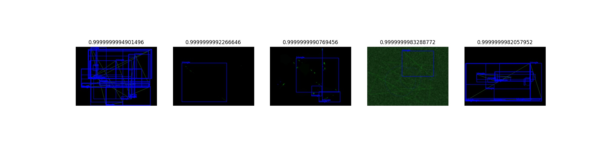
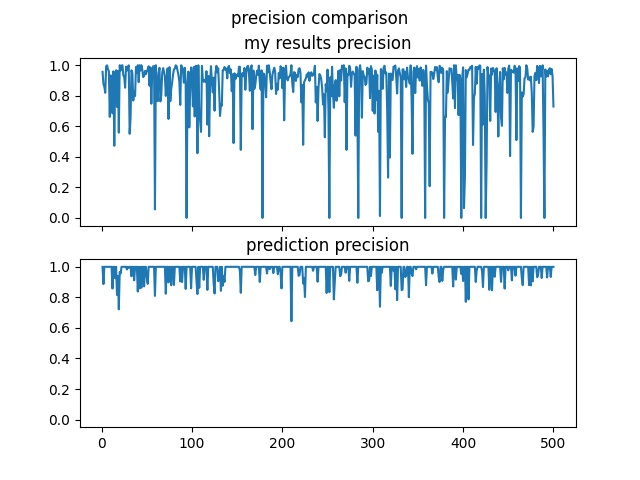
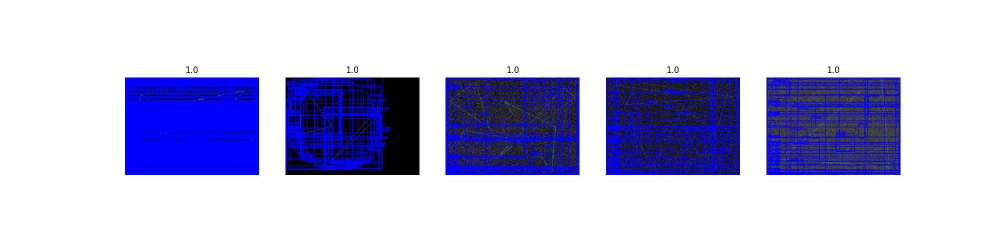

# ShapeDetection

**Itroduction:**  
A world that is full of triangles and circles has been found.  
The mission is to find as many objects as possible, get their correct classification and define the metrics to measure my success.

**Installation:** 
`git clone https://github.com/TzabarDolev/ShapeDetection.git`

**Project requirements appear at requirements.txt file**

**Usage:** 
To display an image with ground truth, prediction and my results: 
`python3 demo.py`

To apply the detection algo: 
`python3 main_detection.py`

To extract quality measures: 
`python3 quality_measures.py`

To show results:
`python3 show_results.py`

To preperly operate the files you need to have a directory named: results, img, ground_truth and prediction. 
`img` folder will hold the images. 
`ground_truth` folder will hold the ground truth json files
`prediction` folder will hold the prdictions given
`results` will gain the results once `python3 main_detection.py` is being operated.

Quality measures metrics chosen: 
<h4>Precision, Recall, IOU</h4>
<h5>Precision: </h5>Precision is the ratio of the number of true positives to the total number of positive predictions. For example, if the model detected 100 trees, and 90 were correct, the precision is 90 percent. 
<h5>Recall: </h5>Recall is the ratio of the number of true positives to the total number of actual (relevant) objects. For example, if the model correctly detects 75 trees in an image, and there are actually 100 trees in the image, the recall is 75 percent. 
<h5>IOU: </h5>The Intersection over Union (IoU) ratio is used as a threshold for determining whether a predicted outcome is a true positive or a false positive. IoU is the amount of overlap between the bounding box around a predicted object and the bounding box around the ground reference data. 

<h5>Prediction algo: </h5>
First of all, breaking the images to different images for circles and for triangles (most of the images are obvious - spheres are red and triangles are green. for those who are not - well, that's a sacrifice i'm willing to make. sort of. After all, I didn't want to be SOTA, I wanted to do something **good** at somewhat close to 8 hours. 
After I seperated the images I used the triangles alone as a seperate input to locate **lines** using canny and hough lines, and the entire image to locate circles (the detection was better for the original image than the circles seperated image) using hough circles. 
I wanted to use simple tools like image gradients and color changes so opencv is a great catch for these ones. Also, we wanted to stay with *classic computer vision* so we didn't need here some big guns like attention, keypoints and CNNs. 
Detection algo ends with a json dump to the results folder. It's important to create this because I didn't create it automatically (8 hours and so).
**python3 quality_measures.py** will give you dataframes of all performances in **pred_performance.txt** and **results_performacen.txt**. 
Use the **python3 show_results.py** to see the top and worst k predictions, and also see comparioson graphs.  
The comparison graphs were meant to give the trend of the images. So if some local minima appear at some prediction case, it may appear also (only lower minima) at my results case. Basically it can help us understand wether we were correct on the easy spots and wrong at the tough ones, and I think it shows something like this.

<h5>Performance:</h5>
IOU:  
Precision:  
Recall:  

<h5>Images: (expand to see something useful)</h5>
Top 5 IOU:
 
Worst 5 IOU:
 
IOU comparison:
 
Top 5 precision:
 
Worst 5 precision:
 
Precision comparison:
 
Top 5 recall:
 
Worst 5 recall:
 
Recall comparison:
 
Recall doesn't look good, but recall calculates TP/(TP+FN), and once almost everything is being marked, there aren't any FN.

<h5>Things I would have done i i had some spare time:</h5> 
1. Add tqdm to long loops 
2. Add legends to graphs 
3. Try again using cv2.findcountours 
4. Add a code to automatically create the results folder if it doesn't exist 
5. Automate show_results.py file 
6. Create a fast-track for a single specific image 
